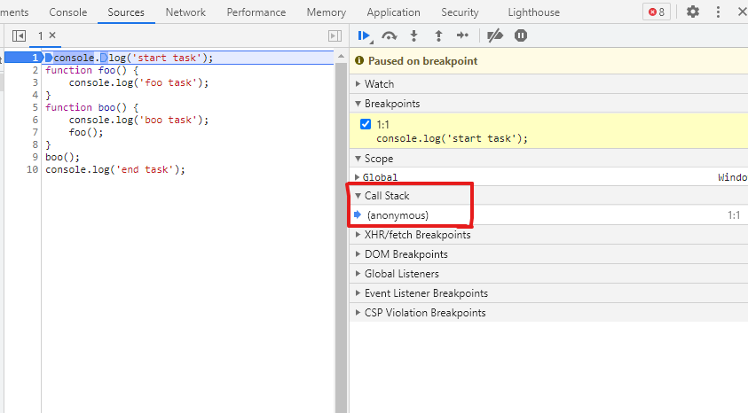
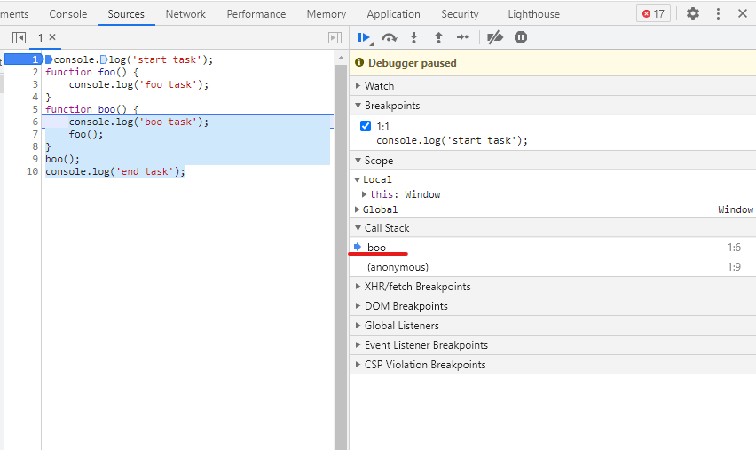
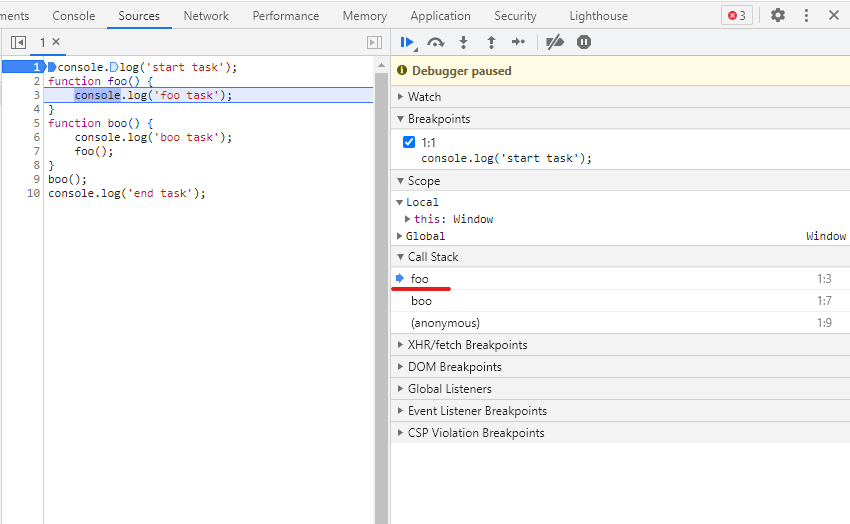
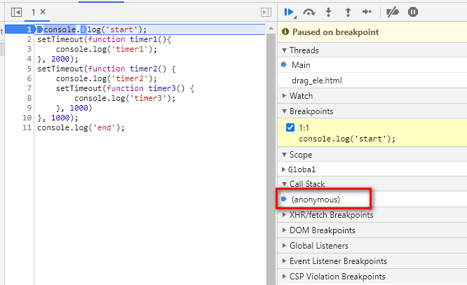
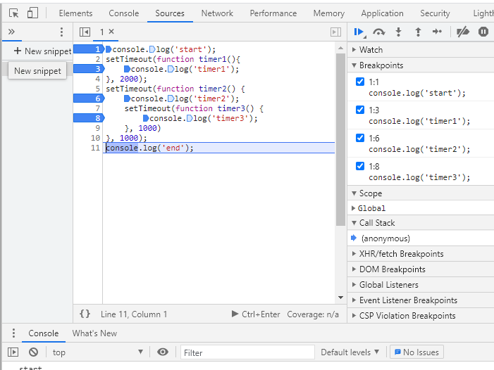
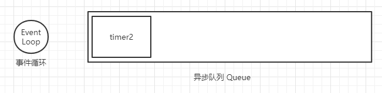
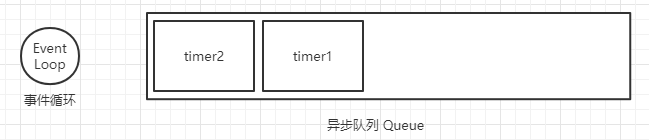
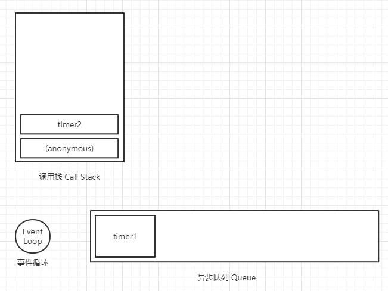
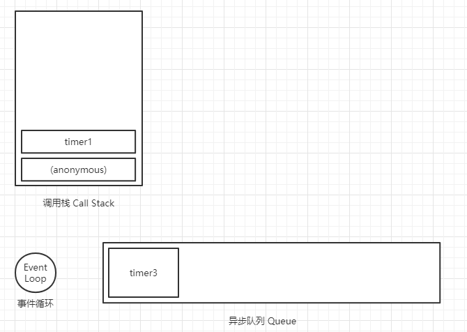

# 单线程
`JavaScript` 是一个单线程解释型脚本语言，当然 `HTML5` 可通过 `Worker` 的来创建后台线程来实现多线程。`JavaScript` 设计之初就是作为脚本语言，做一些 `DOM` 交互的功能，试想下如果设计为多线程来操作同一个 `DOM` ，一个线程在删除一个线程在做修改，那么以谁的操作为准呢？所以这也是 `JavaScript` 需要设计为单线程的原因之一，同时只能允许一个线程在操作 `DOM`。

## 单线程的问题
* 优点：同时只能处理一个任务，确保数据安全。
```javascript
console.log('task 1');
console.log('task 2');
console.log('task 3');
```
* 缺点：效率低，在排队的任务需要等待上一个任务执行完成才能执行
```javascript
console.log('task 1');
for (let i = 0; i < 100000; i++) {
    console.log('task 2'); //比较耗时的任务
}
console.log('task 3');
```
## 解决单线程的问题
`JavaScript` 为了解决单线程上面问题，设计出 **同步模式** 和 **异步模式**。

## 同步模式（Synchronous）
同步模式下，任务需要进行排队，同时只能执行一个任务。如下代码执行过程：
```javascript
console.log('start task');
function foo() {
    console.log('foo task');
}
function boo() {
    console.log('boo task');
    foo();
}
boo();
console.log('end task');
```
以上代码执行结果为：
```
// start task
// boo task
// foo task
// end task
```
在 `JavaScript` 引擎执行过程中，会将全部代码加载，并且在调用栈 `Call Stack` 中压入一个匿名的调用 `(anonymous)` :
   
接着会逐行执行代码:   
* 在第一行会将 `console.log('start task');`, 压入到栈中并且执行，执行完成后会出栈
* 接着将 `boo()` 加入到栈内并且执行代码，在 `boo()` 函数中会先执行 `console.log('boo task');`, 此时输出 `boo task`
  
* 接着遇到 `foo();` 代码，则继续压入调用栈中
  
* 接着将 `foo()` 函数中代码执行, 执行代码 `console.log('foo task');` 此时输出 `foo task`
* 接着 `foo()` 先出栈，然后 `boo()` 出栈，继续往下执行 `console.log('end task');`,此时输出 `end task`.
* 完成执行，调用栈清空

> 同步模式下代码执行顺序很容易理解，按照排队顺序执行即可，当然在同步模式下如果遇到耗时任务，后面任务就会出现延迟，对用户来说就是页面卡顿。所有必须有异步的模式来处理一些耗时任务，例如 `ajax` 请求就需要异步，文件读写等。

## 异步模式（Asynchronous）
不同于同步模式，异步模式是不会等待当前任务执行完成再执行下一个任务，或者说下一行代码。对于异步任务，`JavaScript` 会开启后就立即继续执行下一个任务。
那在异步任务执行完成后可以通过回调函数的形式来调用。

异步模式同样也有自己的问题，例如：代码执行顺序混乱，回调地狱，当然这些都是有对于的解决方案。

### 异步代码执行顺序
分析如下代码执行过程：
```javascript
console.log('start');
setTimeout(function timer1(){
    console.log('timer1');
}, 2000);
setTimeout(function timer2() {
    console.log('timer2');
    setTimeout(function timer3() {
        console.log('timer3');
    }, 1000)
}, 1000);
console.log('end');
```
加载代码之后，会在调用栈 `call stack` 压入匿名的全局调用。
执行第一行 `console.log('start');`,同步代码直接输出 `start`
   
接着会执行 `setTimeout`, 由于是异步的代码，并不会等到定时器执行结果，而是会继续执行下一行。   
同样的执行下一个 `setTimeout` 也是异步任务，会交给浏览器单独执行。
接着会继续执行 `console.log('end');`,输出 `end`.   
   

等到 `1000ms` 后 `timer2` 定时器时间先到了，会将对于的函数放到 消息队列 `Queue` 中, 并且排在第一位中
   

接着 `timer1` 定时器时间到了，也会将函数加入到消息队列中：
   

事件循环 `EventLoop` 会监听 调用栈 `Call Stack` 为空的时候将消息队列中排队函数取出来压入到 调用栈中 `Call Stack` 中执行：
   
```javascript
// timer2
console.log('timer2');
setTimeout(function timer3() {
    console.log('timer3');
}, 1000)
```
`timer2` 函数先执行 `console.log('timer2');` 控制台输出 `timer2`, 接着遇到定时器 `timer3` 继续交给浏览器， `timer3` 会在 `1s` 后加入到消息队列中.
   

`timer2` 会出栈，`EventLoop` 会继续将队列中 `timer1` 压栈执行，此时消息队列只有 `timer3`:
   
```javascript
//timer1
console.log('timer1');
```
`timer1` 执行后控制台输出 `timer1`，继续出栈，入栈下一个 `timer3` 输出 `timer3`

完整输入结果就是：
```javascript
start
end
timer2
timer1
timer3
```