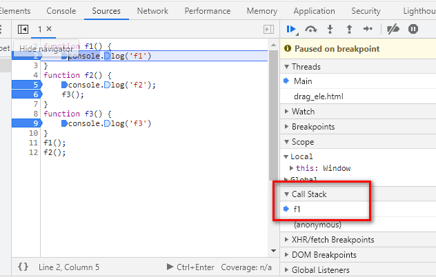
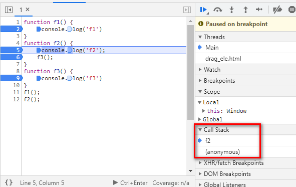
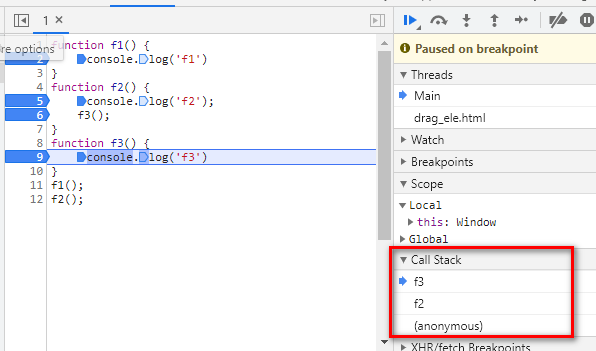
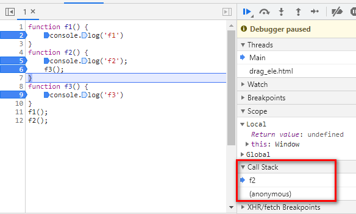
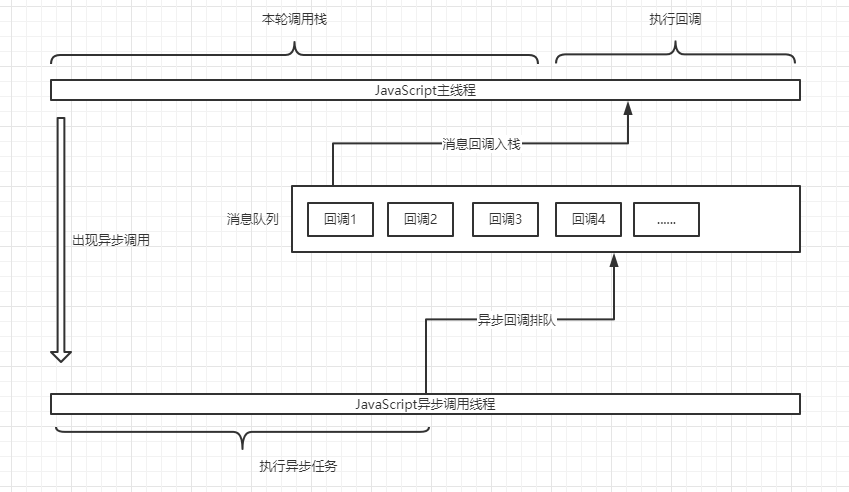

# 事件循环与消息队列
事件循环 `EventLoop` 和消息队列 `Queue` 是 `JavaScript` 语言中非常重要的知识。
`JavaScript` 语言就采用这种机制，来解决单线程运行带来的一些堵塞问题。

## 运行时
`JavaScript` 的运行时包含三大块: **调用栈**,**消息队列**,**事件循环**
* 调用栈是 `JavaScript` 执行函数调用组成，当执行一个函数调用会被压入栈中执行完成后出栈
* 消息队列 是 `JavaScript` 中待处理的消息队列，每个消息会关联一个回调函数，当 调用栈执行完成后，会将该队列最开始进入(先进先出)的消息关联函数,压入栈中执行并且出栈。
* 事件循环 负责监听消息队列是否有可执行关联函数，并且在调用栈为空的时候压入栈中执行，当一个消息处理完成后才会处理下一个消息

## 流程图
  
图片来自 `MDN`

## 调用栈
可以理解为正在执行的任务列表，栈（先进后出）的数据结构，`JavaScript` 遇到函数执行就压入栈，如下：
```javascript
function f1() {
    console.log('f1')
}
function f2() {
    console.log('f2');
    f3();
}
function f3() {
    console.log('f3')
}
f1();
```
   
   
   
   
   

## 消息队列
消息队列可以理解为待办的任务队列，是一个 `Queue` （先进先出）的数据结构，在调用栈的任务执行完成后消息队列任务将会压入到栈中执行，消息队列的任务会进行排队等待压入调用栈

## 事件循环
事件循环(EventLoop)的作用就是负责将消息队列的任务取出来，压入到调用栈中，事件循环监听到调用栈中代码执行完成后，会将消息队列(`Queue`)取出入栈执行。

## 完整执行流程图
   
### 为什么会有主线程和异步线程？
`JavaScript` 不是单线程的吗？确实是，`JavaScript` 中的单线程指的是执行 `JavaScript` 代码是单线程执行，但是浏览器是多线程的，比如像 `setTimeout` 这种浏览器 `API` 是有单独的浏览器线程执行计时，等时间到了后就会将回调加入到消息队列中等待主线程执行完成后就会执行。所以单线程指的是代码是单线程执行。