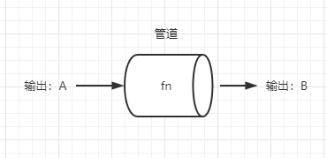
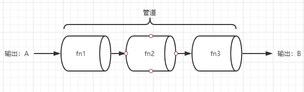

## 函数组合
函数的组合的意思就是将多个函数组合成一个函数，在使用纯函数或者是函数柯里化的时候会很容易写出洋葱代码例如： `_.toUpper(_.first(_.reverse(array)))`。
函数组合可以将细粒度函数重新组合生成一个新的函数，你可以理解为柯里化就是将函数拆分多个，而函数组合则是将函数重组一个。

## 管道的概念
一个函数在接受输出并且返回输出结果，如下图：   
   
* 输出 `A`
* 经过管道 `fn` 运算
* 输出 `B`

管道中可以有多个函数，`fn1`, `fn2` 等等。

那么函数组合(`compose`)就是这个管道的实现，`compose` 需要接受多个函数为参数，并且返回一个新的函数。
```javascript
// 伪代码
// old
const res1 = fn3(fn2(fn1(A)));

// now 使用函数组合
const res2 = compose(fn3, fn2, fn1)(A);
```
> 函数组合默认是从右到左的执行顺序

## `lodash` 中的函数组合的使用
`lodash` 中提供了 `flow` 或者是 `flowRight` 组合函数，`flow` 是由左到右执行，而 `flowRight` 则是右到左执行.
```javascript
const _ = require('lodash');

// 定义三个函数
const reverse = array => array.reverse();
const first = array => array[0];
const upper = s => s.toUpperCase();

// 使用函数组合 先反转函数在取出第一个转为大小
const flow = _.flow(reverse, first, upper);
console.log(flow(['a', 'b', 'c'])); //C
```

## 组合函数的实现
```javascript
function compose(...args) {
    return v => {
        return args.reduce((res, fn) => {
            // 将每一次函数执行结果返回给下一次的函数使用即可
            return fn(res);
        }, v)
    }
}

function composeRight(...args) {
    return v => {
        // 只增加一个反转功能即可
        return args.reverse().reduce((res, fn) => {
            return fn(res);
        }, v)
    }
}

// 箭头函数 一样代码即可完成
const compose2 = (...args) => value => args.reduce((res, fn) => fn(res), value);


const reverse = array => array.reverse();
const first = array => array[0];
const upper = s => s.toUpperCase();
const flow = compose(reverse, first, upper);
console.log(flow(['a', 'b', 'c'])); //C
```

## 结合律
函数组合有一个特点必须要满足结合律，什么是结合律？请看下面例子：
```javascript
compose(compose(f1, f2), f3) === compose(f1, compose(f2, f3)); // true
```
> 等式需要为 `true` 才满足结合律,即组合前两个函数和组合后两个函数，最终输出结果必须相等。
```javascript
const res1 = _.flow(_.flow(_.reverse, _.first), _.toUpper)(['a', 'b', 'c']);
const res2 = _.flow(_.reverse, _.flow(_.first, _.toUpper))(['a', 'b', 'c']);
console.log(res1 === res2); //true
```

## 函数组合的调试
将多个函数组合起来，如何能更好的调试其中某个函数执行的结果呢？
```javascript
let res1 = _.flow(_.reverse, _.first, _.toUpper);
console.log(res1(['a', 'b', 'c'])); //C 

// 增加一个中间调试函数即可
const log = v => {
    console.log(v);
    // 需要返回当前参数给下一个函数执行
    return v;
}

// 柯里化
const trace = _.curry(function (name, v) {
    console.log(name, v)
    return v;
})

res1 = _.flow(_.reverse, log, _.first, _.toUpper); // [ 'c', 'b', 'a' ]  

res1 = _.flow(_.reverse, trace('反转结果'), _.first, trace('first 结果') _.toUpper); // 反转结果 [ 'c', 'b', 'a' ]
// first 结果 c

//在 _.reverse 执行后再执行log 会输出 _.reverse 的执行结果
```