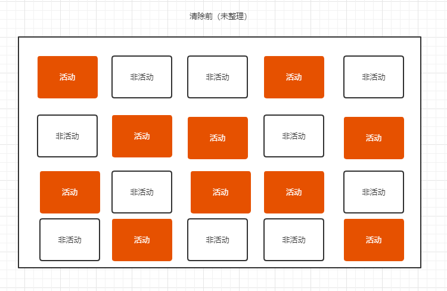
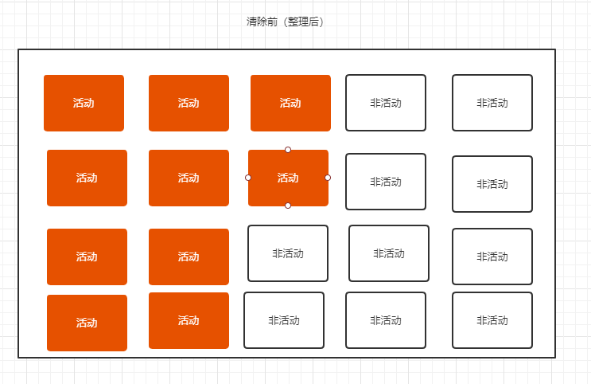
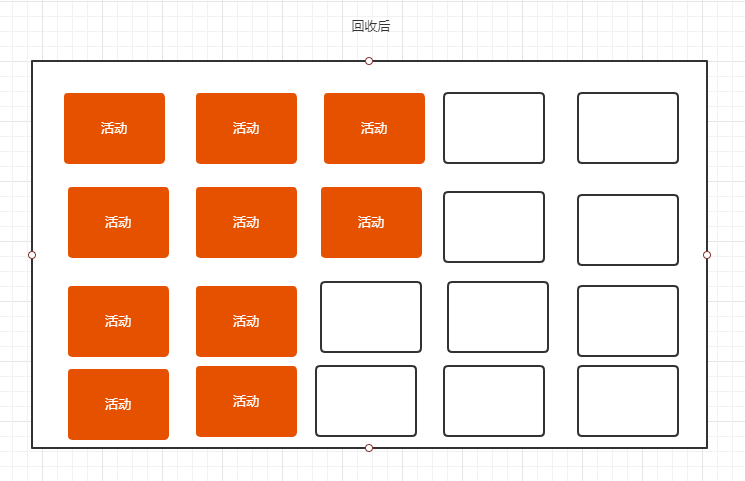

## 常见垃圾回收算法(`GC`)
`GC` 就是 `JavaScript` 中的垃圾回收机制，来完成整个垃圾回收的工作，具体工作内容就是找到垃圾并回收空间，`GC` 算法通过什么规则来查找和释放空间呢？下面是一些常见的 `GC` 算法：   
* 引用计数
* 标记清除
* 标记整理
* 分代回收

### 引用计数算法
* 顾名思义，引用计数算法核心思想就是维护一个引用计数表，每次引用计数则会加1，当判断出当前引用计数为0则进行清除。
* 引用计数器：当引用关系发生改变时则会修改引用计数，例如对象 `a` 被 `b` 引用了，则计数器加一，如果又被 `c` 应用则再加一。假如 `c=null` 则引用计数减一。
* 引用计数为0是则 `GC` 会立即回收空间

### 引用计数优缺点
**优点**      
* 发现垃圾时会立即回收，每次引用发生变化并且检测出引用次数为0则会立即回收

**缺点**   
* 无法回收循环引用的对象。
```javascript
// 正常引用
function fn1() {
    const a = {name: 'a'};
    const b = {name: 'b'};
}
fn1(); // 当调用完成函数之后 a b 的引用会为0，所以会被回收空间

// 循环引用
function fn2() {
    const a = {name: 'a'};
    const b = {name: 'b'};

    a.ref = b;
    b.ref = a;

}
fn2(); // 执行完成函数后，由于 a 的 ref 属性还引用了b b 的ref属性也引用了a,发生了循环引用，计数不为0，所以不会被回收
```
* 时间开销大，因为需要时刻监听所以对象引用发生变化，而进行计算新的引用次数，有一定的时间消耗

### 标记清除算法
标记清除算法是 `V8` 引擎中使用的垃圾回收算法，核心流程分为两个阶段: **标记和清除**。
* 标记：首先会遍历所有的对象并标记活动的对象
* 清除：遍历所有对象，清除没有被标记的对象，同时也会将第一阶段被标记的对象抹掉标记状态
* 被标记清除的回收空间会被放置到一个空闲列表中，方便有需要申请新的空间时立即使用。

### 标记清除算法优缺点
**优点**   
* 解决了引用计数算法的循环引用的问题。

**缺点**   
* 会产生空间的碎片化，由于当前回收的垃圾在地址上是不连续的，这种不连续的会造成他们分散在各个角落，如果申请新的空间和当前回收大小不一致（多了或者少了），就会产生碎片了。如果一致就不会有问题。

### 标记整理算法实现原理
* 标记整理相当于是标记清除的增加版本
* 他的标记阶段和清除阶段是和标记清除是一致的
* 唯一不一样是，在清楚阶段会先执行一边整理操作，将对象位置移动后再进行清除阶段
清除前的对象排序顺序可能是乱的：
   
整理后   
   
接着会将非活动对象，也就是右侧的对象回收：   
   

> 标记整理的优势显而易见，就是为了优化标记清除的空间碎片化问题，整理后的空间基本是连续的，就不会产生碎片化空间。

## 总结
* 引用计数算法：通过计数器来维护每一个对象引用的次数，缺点是有循环引用问题，优点可以及时回收
* 标记清除算法：先标记未活动的对象，接着再清除它们，清除后会重置标记状态并且将空间暂存方便下次使用，缺点是会产生空间碎片化问题。优点解决了循环引用问题
* 标记整理算法：和标记清除类似，只是在清楚前先整理空间，避免产生空间碎片化问题，很完美，解决上面两种问题。