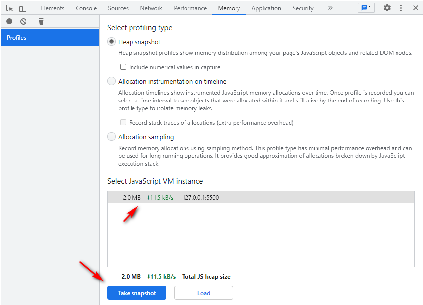
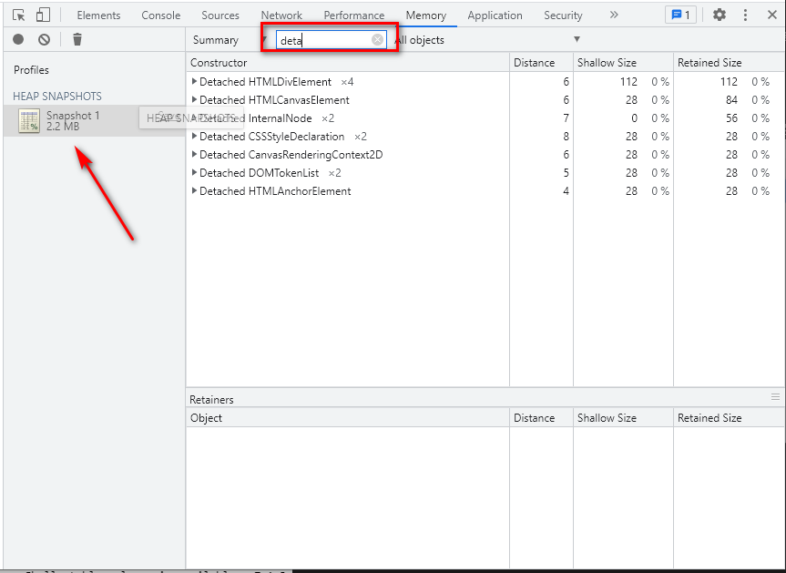
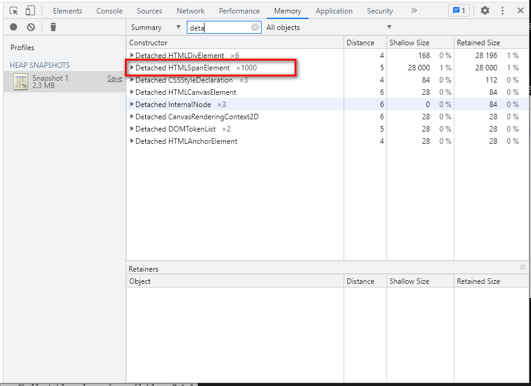

## Perfomance 介绍
`Perfomance` 是 `chrome` 中自带的性能调试工具,使用方法如下：   
   

## 内存出现问题的标准
内存存在问题通产会有以下现象：   
* 内存使用在持续的升高，产生内存泄漏
* 出现频繁的垃圾回收，通过内存变化图可以分析出

## 如何监视内存？
* 任务管理器监视内存: 使用浏览器的内置的任务管理器可以监视内存的变化。
* `Timeline` 时序图记录可以看到内存使用情况
* 对快照查找是否存在分离的`DOM` 结构

### 任务管理器
`Chrome` 浏览器打开任务管理器快捷键 `Shift+Esc`,接着右键，勾选`JavaScript` 使用内存即可。
   
   
如果该内存在不断增加，说明可能存在内存泄漏问题。
> 任务管理器只适于用来判断当前脚本是否存在内存问题，并不能定位到具体的脚本代码处

### `Timeline` 记录内存
通过时间线记录内存变化图可以更精确的定位到脚本执行的内存时间节点。
执行下面 `html` 代码：
```html
<!DOCTYPE html>
<html lang="en">
<head>
    <meta charset="UTF-8">
    <meta http-equiv="X-UA-Compatible" content="IE=edge">
    <meta name="viewport" content="width=device-width, initial-scale=1.0">
    <title>时间线演示定位内存问题具体代码位置</title>
</head>
<body>
    <button id="add">添加DOM</button>

    <script>
        const arr = [];
        function add() {
            for (let i = 0; i < 10000; i++) {
                document.body.appendChild(document.createElement('div'));
            }
            arr.push(new Array(10000000).join('x'));
        }
        document.getElementById('add').addEventListener('click', add);
    </script>
</body>
</html>
```
打开浏览器 `Perfomance` 点击录制 `Record`, 接着点击几次 **添加DOM** 按钮，过几秒后点击 `stop` 结束录制。
下面截图，就是只显示 `JS Heap` 执行的时序内存线，随着点击添加`DOM`整体是增加过程。并且每隔一段就会有起伏的过程，
   
起伏过程是 `V8` 在空闲的的时候执行了 `GC` 回收空间操作产生的效果。

继续往下可以看到具体代码函数，执行消耗时间。
   
> 可以看到在 执行 `add` 函数和 `function call`(函数回调) 、`Event`(DOM事件) 是消耗的时间最多的

## 堆块照(`Heap snapshot`)查找分离DOM
`DOM` 状态分为：
* 存活状态：界面中存活的`DOM` 树上的
* 垃圾状态：垃圾对象中的 `DOM` 节点
* 分离状态：在 `JavaScript` 中有引用，没有存活在 `DOM` 树上的节点。内存中有，界面中没有的，这种 `DOM` 容易出现内存泄漏
使用堆照功能可以找出分离状态的 `DOM`,从而去优化。

创建 `html` 文件，添加如下测试代码：
```html
<!DOCTYPE html>
<html lang="en">
<head>
    <meta charset="UTF-8">
    <meta http-equiv="X-UA-Compatible" content="IE=edge">
    <meta name="viewport" content="width=device-width, initial-scale=1.0">
    <title>堆块照查找分离DOM</title>
</head>
<body>
    <button id="add">创建DOM</button>
    <script>

        let divDom = null;
        function add() {
            divDom = document.createElement('div');
            for (let i = 0; i < 1000; i++) {
                divDom.appendChild(document.createElement('span'))
            }
        }
        document.getElementById('add').addEventListener('click', add);
    </script>
</body>
</html>
```

查看没有点击创建 `DOM` 之前的堆快照信息：
   
如上界面下点击 `Take snapshot` 生成快照.
   
> 筛选出 `deta` 可以找出 `DOM` 节点信息，此时是正常的，未发现有明显多于的分离 `DOM`
接着点击 页面中 **创建DOM**后再次点击 `Take snapshot`。发现代码中创建的 `1000` 个 `span` 节点出现了。此时的 `span` 是分离 `DOM`。
   

### 如何处理分离 `DOM`
很简单，在 `JavaScript` 代码中清空掉创建了但没有使用的 `DOM` 节点即可。事实上很多时候并未发生，需要借助该工具来分析。

### 如何判断是否存在频繁 `GC`
频繁的 `GC` 会导致应用程序会停止，所以会出现假死，用户能明显感知页面卡顿。
1. 通过查看 `TimeLine` 中频繁的上升下降图来判断，当走势图出现一直向上局势，并且偶然下降后又立马持续向上，如此重复过程，则是内存可能出现泄漏 `GC` 频繁的执行现象。
2. 通过任务管理器中查看 `JavaScript` 执行的内存出现瞬间增加和瞬间减少状态，则有可能是 `GC` 在频繁的工作导致的。

## 总结
通过 `Perfomance` 工具来监视网页工作时内存信息来找出存在问题。`Perfomance` 提供了 任务管理器监视 `JavaScript` 或者 `CSS` 内存信息，`TimeLine` 可以详细定位到具体耗内存的代码部分。而 堆快照可以找出一些分离 `DOM`。三种方式都有不同特点来找出内存问题。