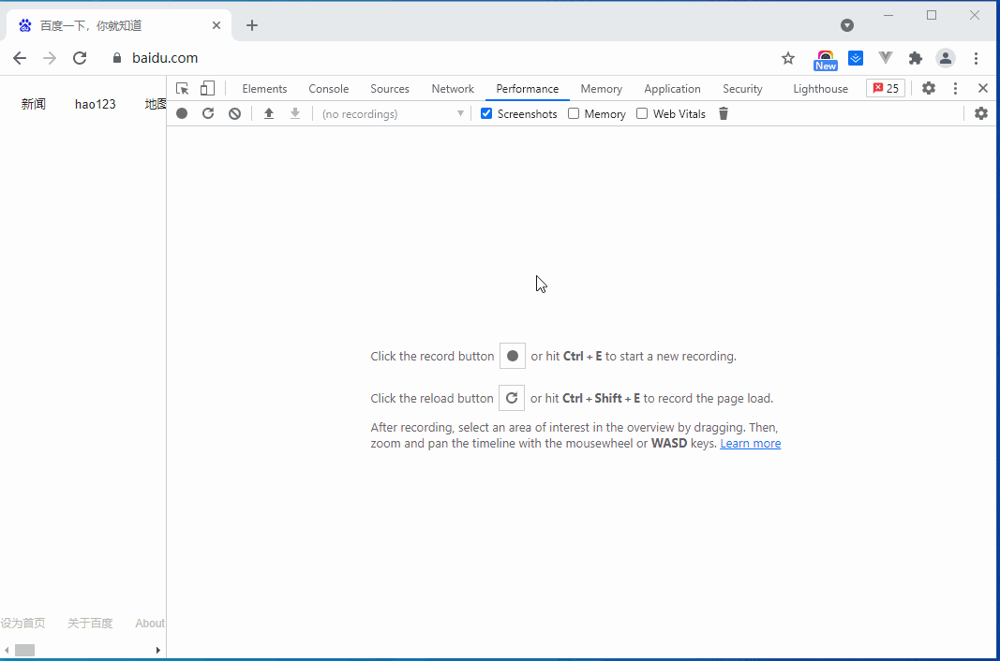
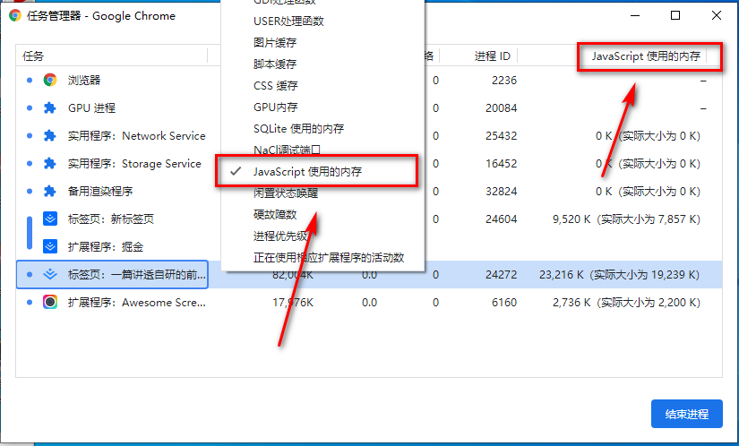
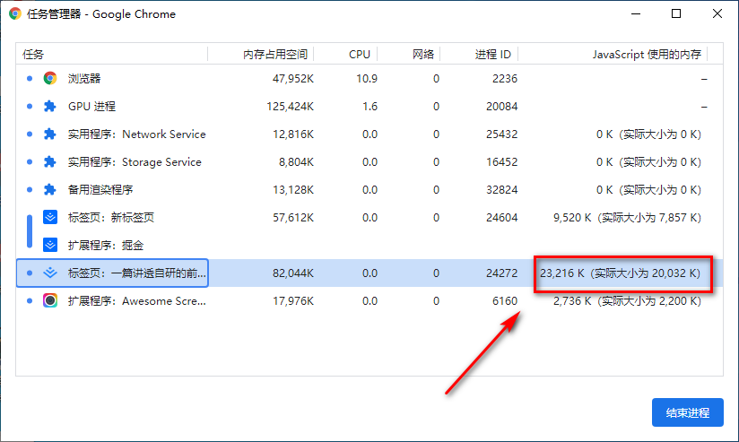
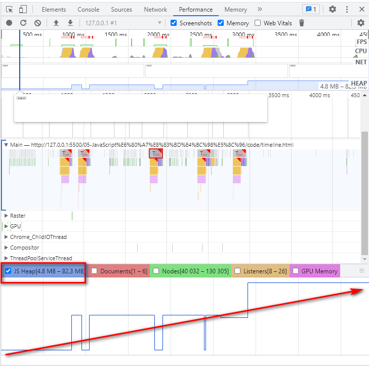
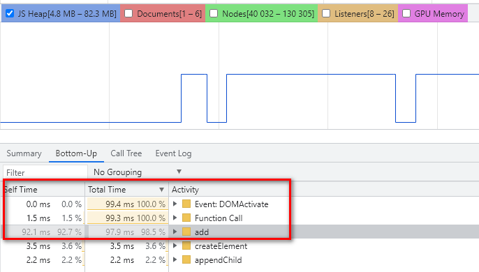

## Perfomance 介绍
`Perfomance` 是 `chrome` 中自带的性能调试工具,使用方法如下：   
   

## 内存出现问题的标准
内存存在问题通产会有以下现象：   
* 内存使用在持续的升高，产生内存泄漏
* 出现频繁的垃圾回收，通过内存变化图可以分析出

## 如何监视内存？
* 任务管理器监视内存: 使用浏览器的内置的任务管理器可以监视内存的变化。
* `Timeline` 时序图记录可以看到内存使用情况
* 对快照查找是否存在分离的`DOM` 结构

### 任务管理器
`Chrome` 浏览器打开任务管理器快捷键 `Shift+Esc`,接着右键，勾选`JavaScript` 使用内存即可。
   
   
如果该内存在不断增加，说明可能存在内存泄漏问题。
> 任务管理器只适于用来判断当前脚本是否存在内存问题，并不能定位到具体的脚本代码处

### `Timeline` 记录内存
通过时间线记录内存变化图可以更精确的定位到脚本执行的内存时间节点。
执行下面 `html` 代码：
```html
<!DOCTYPE html>
<html lang="en">
<head>
    <meta charset="UTF-8">
    <meta http-equiv="X-UA-Compatible" content="IE=edge">
    <meta name="viewport" content="width=device-width, initial-scale=1.0">
    <title>时间线演示定位内存问题具体代码位置</title>
</head>
<body>
    <button id="add">添加DOM</button>

    <script>
        const arr = [];
        function add() {
            for (let i = 0; i < 10000; i++) {
                document.body.appendChild(document.createElement('div'));
            }
            arr.push(new Array(10000000).join('x'));
        }
        document.getElementById('add').addEventListener('click', add);
    </script>
</body>
</html>
```
打开浏览器 `Perfomance` 点击录制 `Record`, 接着点击几次 **添加DOM** 按钮，过几秒后点击 `stop` 结束录制。
下面截图，就是只显示 `JS Heap` 执行的时序内存线，随着点击添加`DOM`整体是增加过程。并且每隔一段就会有起伏的过程，
   
起伏过程是 `V8` 在空闲的的时候执行了 `GC` 回收空间操作产生的效果。

继续往下可以看到具体代码函数，执行消耗时间。
   
> 可以看到在 执行 `add` 函数和 `function call`(函数回调) 、`Event`(DOM事件) 是消耗的时间最多的

## 