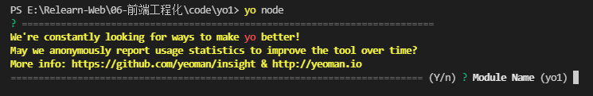
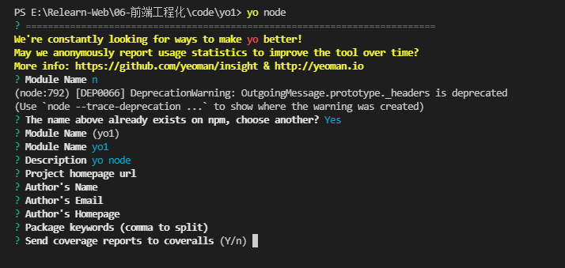
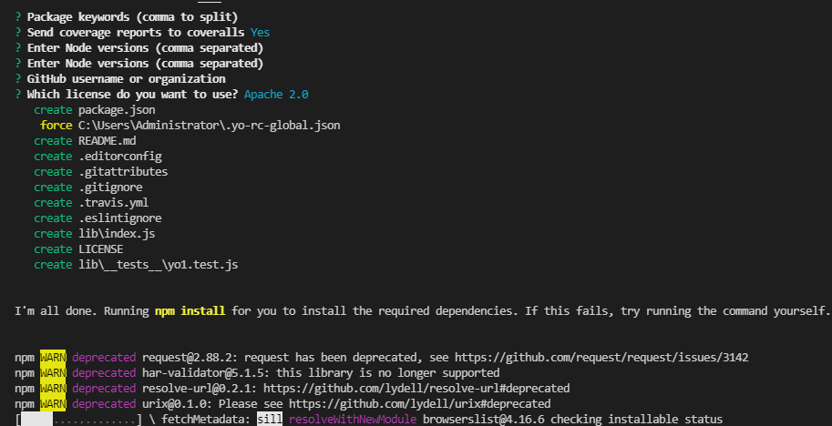
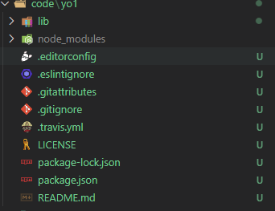
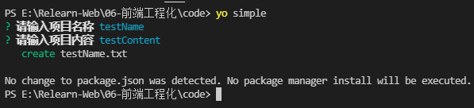

## 什么是脚手架？
`vue-cli` 是 `Vue` 框架官方的一个脚手架，它提供了创建一个基础的 `Vue` 项目，提供了开发规范，集成了一些插件，方便我们直接在该基础项目中直接开发。
可以理解为，脚手架就是帮我们搭建好一个基础项目，我们不需要每次再开发新项目的时候从0开始搭建项目环境。

## 脚手架做到事情
* 相同的组织结构
* 相同的开发范式
* 相同的模块依赖
* 相同的工具配置
* 相同的基础代码
> 脚手架目的就是帮助开发者处理新建项目过程中的一些重复工作，来快速搭建项目骨架。

## IDE集成
通常很多 `IDE` 再创建项目过程中就已经集成脚手架的工作，例如安卓开发工具 `Android Studio`, 或者是 `Flutter` 开发工具。由于前端框架多样性导致并没有很好的集成，通常各种框架都会有对应的 `cli`.

## 常用的脚手架
* `React` 项目有 `create-react-app`
* `Vue` 项目有 `vue-cli`
* `Angular` 项目有 `angular-cli`
> 基本是各自的框架有自己的脚手架工具

## 脚手架做的事情
通过接收用户输入信息来自动创建对应的项目基础结构，创建特定文件,相关的配置。他们特点是只为特定的框架生成项目

## 通用脚手架工具 `Yeoman`
`Yeoman` 用于创建现代化 `Web` 项目的脚手架工具,基于 `node.js` 开发。它的优势是通用性，可以通过创建不同的 `generator` 的方式来定制不同的脚手架。

## `Yeoman` 基本使用

### 全局安装 `yo`
`yarn global add yo`

### 安装 `generator-node`
`generator-node` 是  `Yeoman` 平台已经提供了的一个用于创建 `node.js` 脚手架的 `generator`。我们可以直接使用它来创建我们的项目。
`yarn global add generator-node`

### 创建脚手架
在 `yo1` 目录中执行：   
`yo node` 使用已经安装的 `generator-node`   
* 是否同意上报数据,随意填写 `n`   
      
* 提示该模块名字在 `npm` 网站中已经存在，是否继续使用 `Yes`   
     
* 其他就是按提示填写，模块描述，作者，关键字，首页，支持的 `node.js` 版本，协议信息等   
     
     
* 完了之后最终会目录中多出了这么多文件   
  

> 以上就是脚手架的工作流程

## `Yeoman` 流程总结
首先在全局安装 `Yeoman` 包 `yo`, 接着安装对应的 `generator`, 不同项目有不同的 `generator` , 使用 `yo` 来运行已经安装的 `generator`，通过命令行交互的方式输出一些项目配置内容来完成项目接口创建。

## 自定义 `generator`
除了使用平台提供的 `generator`, 我们也可以开发自己的 `generator` 来实现个性化的脚手架。

### 1.创建 `generator` 目录
创建生成器目录:   
```
generators
│  package.json
│  yarn-error.log
│
├─app // 默认生成器 `generator`
│   index.js
│
└─node-app // 其他生成器 `generator`
    index.js

```

### 2.命名要求
`generator` 名称必须以 `generator-<name>` 命名，否则无法找到对应的 `generator`.

### 3.安装 `yeoman-generator`
`yeoman-generator` 模块提供了生成器 `generator` 的一个基类,提供了一个工具函数，和钩子，让我们在创建 `generator` 更便捷，在 `code` 目录下 新建 `generator-simple`目录 并进入目录中执行:   
```
yarn init -y
yarn add yeoman-generator
```   
### 4.创建脚手架入口文件
在 `generator-simple` 文件夹中新建 `generators` 文件夹，并且在 `generators` 文件夹中新建 `app` 文件夹，进入该文件夹中新建 `index.js` 作为脚手架入口文件。

### 5.编写脚手架逻辑
在 `index.js` 中编写如下代码：   
```javascript
// 引入基类
const Generator = require('yeoman-generator');

// 需要继承 基类 Generator 并且导出
module.exports = class extends Generator {
    // 基类的方法
    writing() {
        // 调用基类的fs对象中方法 写入文件test.json 内容为 writing
        this.fs.write(this.destinationPath('test.json'), 'writing');
    }
}
```

### 6.注册脚手架
在 `generator-simple` 目录下执行 `yarn link`

### 7.使用脚手架
在 `code` 目录下执行 `yo simple`, 控制台会输出 `create test.json`，并且在 `code` 目录中创建了 `test.json` 文件

### 8.根据模板创建
在 `app` 目录下新建存放模板的文件夹 `templates`, 在该目录下新建一个模板 `test.txt`, 模板支持 `EJS` 模板语法，例如在 `json.txt` 中输出以下内容:   
```
可以使用 EJS 模板语法

项目名称 <%= title %>

文件内容 <%= content %>
```
### 9.使用模板
修改 `index.js` 写入文件方法：   
```javascript
const Generator = require('yeoman-generator');

// 需要继承 基类 Generator 并且导出
module.exports = class extends Generator {
    // 父类的方法
    writing() {
        // 使用模板文件
        const tmpl = this.templatePath('test.txt');
        // 输出目标文件
        const outfile = this.destinationPath('simple.txt');

        // 模板上下文 用于替换模板中的内容
        const context = {
            title: 'simple脚手架',
            content: '支持ejs模板语法'
        };
        // 通过模板文件输出文件
        this.fs.copyTpl(tmpl, outfile, context);
    }
} 
```
再次执行 `yo simple` 在 `code` 中自动创建了 `simple.txt`,如下内容   
```
可以使用 EJS 模板语法

项目名称 simple脚手架

文件内容 支持ejs模板语法
```

### 10.增加命令行交互
`Generator` 基类提供了 `prompting` 钩子支持接收用户控制台输入信息.
```javascript
const Generator = require('yeoman-generator');

// 需要继承 基类 Generator 并且导出
module.exports = class extends Generator {
    prompting() {
        return this.prompt([
            {
                type: 'input',
                name: 'name',
                message: '请输入项目名称',
                default: this.appname, //默认值使用项目目录名
            },
            {
                type: 'input',
                name: 'content',
                message: '请输入项目内容',
                default: '',
            }
        ]).then(answers => {
            // 保存用户输入的值 在模板中可以使用
            this.answers = answers;
        })
    }
    // 父类的方法
    writing() {
        // 使用模板文件
        const tmpl = this.templatePath('test.txt');
        // 输出目标文件
        const outfile = this.destinationPath(`${this.answers.name}.txt`);
        
        // 通过模板文件输出文件 传入用户输入的值
        this.fs.copyTpl(tmpl, outfile, this.answers);
    }
}
```
  

## 脚手架案例
开发一个生成 `vue` 项目的脚手架.